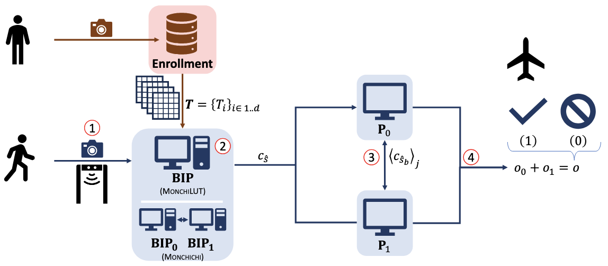

<div align="center">    
 
# Another Walk for Monchi
 <br> 
[](https://fps-2024.hec.ca/)
[](https://creativecommons.org/licenses/by-nc/4.0/)
<br>

</div>

## Description

This repository contains the official code of the research paper [Another Walk for Monchi](https://eprint.iacr.org/2024/1445) pusblished at [FPS2024](https://fps-2024.hec.ca/).<br>

## Abstract
> Monchi is a new protocol aimed at privacy-preserving biometric identification. It begins with scores computation in the encrypted domain thanks to homomorphic encryption and ends with comparisons of these scores to a given threshold with function secret sharing. We here study the integration in that context of scores computation techniques recently introduced by Bassit et al. that eliminate homomorphic multiplications by replacing them by lookup tables. First, we extend this lookup tables biometric recognition solution by adding the use of function secret sharing for the final comparison of scores. Then, we introduce a two-party computation of the scores with lookup tables which fits nicely together with the function secret sharing scores comparison. Our solutions accommodate well with the flight boarding use case introduced by Monchi.
## How to run
### Dependecies
- _Languages_: Go (1.23), C (99+), Python (3.8+)
- _Platforms_: Linux, MacOS
- _Dependencies_: `tuneinsight/lattigo/v4 v4.1.0`
- _Code Author_: Anonymous
- _License_: GNU GPLv3 (any code derived from this must be **open source**)
### Launch an experiment
- First, follow the instructions in `funshade/README.md` to generate the shared object files.
- Generate the borders and mfip-tables by running `mfip-tables/genBorderMFIP.py`.
- Place any 128 feature biometric data in `monchi-lut/data/`
- Use `go run .` inside both `monchi-lut` and `monchichi` to execute.
## Authors
* **Riccardo Taiello**  - [github](https://github.com/rtaiello) - [website](https://rtaiello.github.io)
* **Emre Tosun**  - [github](https://github.com/emretosn) - [LinkedIn](https://www.linkedin.com/in/emretsn/)
* **Alberto Ibarrondo** - [LinkedIn](https://www.linkedin.com/in/albertoibarrondo/)
* **Hervé Chabanne** - [LinkedIn](https://www.linkedin.com/in/herv%C3%A9-chabanne-2627727/)
* **Melek Önen**  - [website](https://www.eurecom.fr/en/people/onen-melek)
## Contributors:
* **Riccardo Taiello**  - [github](https://github.com/rtaiello) - [website](https://rtaiello.github.io)
* **Emre Tosun**  - [github](https://github.com/emretosn) - [LinkedIn](https://www.linkedin.com/in/emretsn/)

## Cite this work
```
@misc{cryptoeprint:2024/1445,
      author = {Riccardo Taiello and Emre Tosun and Alberto Ibarrondo and Hervé Chabanne and Melek Önen},
      title = {Another Walk for Monchi},
      howpublished = {Cryptology {ePrint} Archive, Paper 2024/1445},
      year = {2024},
      url = {https://eprint.iacr.org/2024/1445}
}
```
